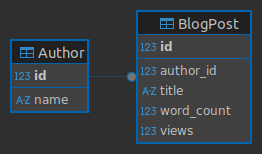
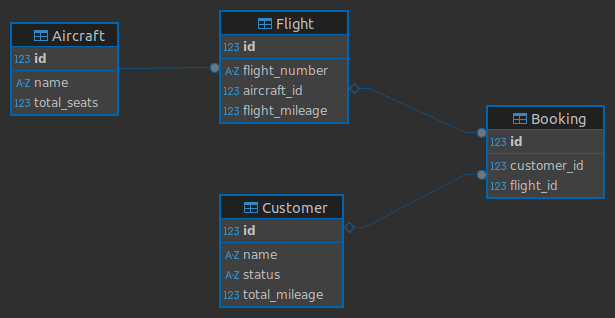

# Lab 3.02: SQL
SQL Practice

## Repositorio del lab con scripts SQL:

- **blogDB_ddl.sql**: Tablas y datos de ejemplo para un pequeño blog.
- **airlineDB_ddl.sql**: Tablas y datos de ejemplo para una base de datos de aerolínea.
- **airline_queries.sql**: Consultas requeridas sobre la base de datos de aerolínea.

## Esquemas de las data bases:

### BlogDB

### AirlineDB

